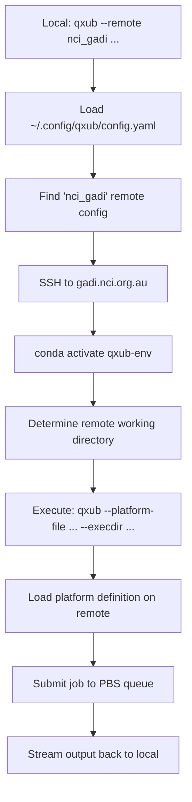

# qxub Remote Execution Workflow

## Overview

qxub v2.2 introduces remote execution capabilities that allow you to submit jobs to remote HPC systems from your local development environment. This document explains how remote execution works and how to use it effectively.

## Execution Flow

### Local to Remote Workflow



### Detailed Steps

1. **Command Parsing**: Local qxub detects `--remote` flag
2. **Configuration Loading**: Load remote config from `~/.config/qxub/config.yaml`
3. **SSH Connection**: Connect using settings from `~/.ssh/config`
4. **Environment Setup**: Activate specified conda environment on remote
5. **Working Directory**: Determine appropriate remote execution directory
6. **Remote Execution**: Run qxub on remote system with platform-specific arguments
7. **Output Streaming**: Real-time output forwarding to local terminal

## CLI Usage

### Basic Remote Execution

```bash
# Submit job to remote system
qxub --remote nci_gadi --env pytorch -- python train.py

# Equivalent to running this on the remote system:
# qxub --platform-file /path/to/nci_gadi.yaml --execdir /scratch/project/user/projects/current-dir --env pytorch -- python train.py
```

### Command Line Options

#### `--remote REMOTE_NAME`
- **Purpose**: Specify remote system for execution
- **Required**: For remote execution
- **Example**: `--remote nci_gadi`

#### Remote-specific behavior
When `--remote` is used:
- Local qxub acts as a client, forwarding execution to remote system
- Platform is automatically determined from remote configuration
- Working directory defaults to smart project-based path
- All other qxub options are forwarded to remote execution

### Working Directory Specification

```bash
# Use default remote working directory (recommended)
qxub --remote nci_gadi --env pytorch -- python train.py

# Override remote working directory
qxub --remote nci_gadi --execdir /scratch/a56/jr9959/specific-project --env pytorch -- python train.py

# Use relative path (relative to project_root_dir)
qxub --remote nci_gadi --execdir experiments/run1 --env pytorch -- python train.py
```

### Environment and Resource Specification

```bash
# Specify conda environment on remote system
qxub --remote nci_gadi --env tensorflow-gpu --queue gpu -- python model.py

# Resource requirements (applied on remote system)
qxub --remote nci_gadi --cores 24 --memory 48GB --walltime 12:00:00 -- ./simulation

# GPU jobs
qxub --remote nci_gadi --gpus 2 --env pytorch-gpu -- python gpu_training.py
```

## Working Directory Logic

### Default Behavior

Local directory: `~/research/protein-folding/`
Remote config: `project_root_dir: /scratch/${PROJECT}/${USER}/projects`
Result: Remote execdir = `/scratch/a56/jr9959/projects/protein-folding`

### Directory Resolution Order

1. **Explicit `--execdir`**: Use specified path (absolute or relative to project_root_dir)
2. **Smart default**: `{project_root_dir}/{local_directory_name}`
3. **Fallback**: Remote home directory if project_root_dir not configured

### Examples

```bash
# Local: ~/experiments/deep-learning/
# Config: project_root_dir: /scratch/a56/jr9959/projects
# Result: /scratch/a56/jr9959/projects/deep-learning

# Explicit override
qxub --remote nci_gadi --execdir /g/data/a56/shared/models -- python train.py

# Relative to project_root_dir
qxub --remote nci_gadi --execdir experiments/run-001 -- python train.py
# Result: /scratch/a56/jr9959/projects/experiments/run-001
```

## File Synchronization

**Important**: qxub remote execution does NOT automatically synchronize files. You are responsible for ensuring your code and data are available on the remote system.

### Recommended Workflow

1. **Version Control**: Use git repositories accessible from both systems
2. **Shared Storage**: Leverage shared filesystems (e.g., `/g/data`, `/scratch`)
3. **Manual Sync**: Use `rsync`, `scp`, or similar tools when needed

### Example Workflow

```bash
# On local machine: commit changes
git add .
git commit -m "Update training script"
git push

# On remote system: code is automatically updated via shared filesystem
# OR pull changes if using separate repositories
ssh gadi.nci.org.au "cd /scratch/a56/jr9959/projects/my-project && git pull"

# Submit job remotely
qxub --remote nci_gadi --env pytorch -- python train.py
```

## Platform Integration

### Platform Selection

Remote execution automatically uses the platform definition specified in the remote configuration:

```yaml
# In ~/.config/qxub/config.yaml
remotes:
  nci_gadi:
    platform_file: /g/data/a56/software/qsub_tools/docs/platforms/nci_gadi.yaml
```

The remote qxub command receives:
```bash
qxub --platform-file /g/data/a56/software/qsub_tools/docs/platforms/nci_gadi.yaml [other-args]
```

### Queue Selection

Queue selection works normally on the remote system:

```bash
# Automatic queue selection based on resources
qxub --remote nci_gadi --gpus 2 -- python train.py  # Uses GPU queue

# Explicit queue specification
qxub --remote nci_gadi --queue normalsl -- python quick_test.py

# Queue auto-selection with --queue auto
qxub --remote nci_gadi --queue auto --cores 96 -- python big_job.py
```

## Error Handling and Troubleshooting

### Connection Errors

**SSH Connection Failed**
```
Error: Failed to connect to nci_gadi (gadi.nci.org.au)
Suggestion: Check your SSH configuration and network connectivity
Debug: ssh gadi.nci.org.au echo "test"
```

**SSH Authentication Failed**
```
Error: Authentication failed for nci_gadi
Suggestion: Verify SSH keys and ~/.ssh/config settings
Debug: ssh -v gadi.nci.org.au
```

### Environment Errors

**Conda Environment Not Found**
```
Error: Conda environment 'qxub-prod' not found on nci_gadi
Available environments: base, pytorch, tensorflow
Suggestion: Update qxub_env in ~/.config/qxub/config.yaml
```

**qxub Not Available**
```
Error: qxub command not found in environment 'qxub-prod'
Suggestion: Install qxub in the specified conda environment
Debug: ssh nci_gadi "conda activate qxub-prod && which qxub"
```

### Platform Errors

**Platform File Not Found**
```
Error: Platform file not found: /g/data/a56/software/qsub_tools/docs/platforms/nci_gadi.yaml
Suggestion: Verify platform_file path in remote configuration
Fallback: Searching XDG_CONFIG_DIRS for platform definitions
```

### Debugging Remote Execution

Use verbose mode to see detailed execution steps:

```bash
qxub --remote nci_gadi --verbose --env pytorch -- python train.py
```

Output includes:
- SSH connection details
- Conda activation commands
- Remote working directory resolution
- Full remote qxub command
- Platform loading information

### Manual Testing

Test each component independently:

```bash
# Test SSH connection
ssh nci_gadi echo "Connection OK"

# Test conda environment
ssh nci_gadi "conda activate qxub-prod && qxub --version"

# Test platform file access
ssh nci_gadi "cat /g/data/a56/software/qsub_tools/docs/platforms/nci_gadi.yaml"

# Test remote execution manually
ssh nci_gadi "conda activate qxub-prod && cd /scratch/a56/jr9959/projects/my-project && qxub --platform-file /g/data/a56/software/qsub_tools/docs/platforms/nci_gadi.yaml --env pytorch -- python train.py"
```

## Performance Considerations

### Connection Optimization

Configure SSH connection multiplexing in `~/.ssh/config`:

```ssh
Host gadi.nci.org.au
    ControlMaster auto
    ControlPath ~/.ssh/master-%r@%h:%p
    ControlPersist 10m
```

### Output Streaming

- Output is streamed in real-time from remote to local terminal
- Large output may impact performance over slow connections
- Consider redirecting output to files for long-running jobs

### Session Management

For long-running jobs, consider using screen/tmux on the remote system:

```bash
qxub --remote nci_gadi --pre "screen -S job1" --env pytorch -- python long_job.py
```

## Best Practices

1. **Test Locally First**: Validate jobs on local/interactive systems before remote submission
2. **Use Version Control**: Ensure code synchronization between local and remote
3. **Monitor Resources**: Use appropriate resource requests to avoid queue delays
4. **Check Quotas**: Verify storage and compute quotas before large jobs
5. **Plan Data Movement**: Consider data location and transfer requirements
6. **Use Shared Storage**: Leverage shared filesystems when available
